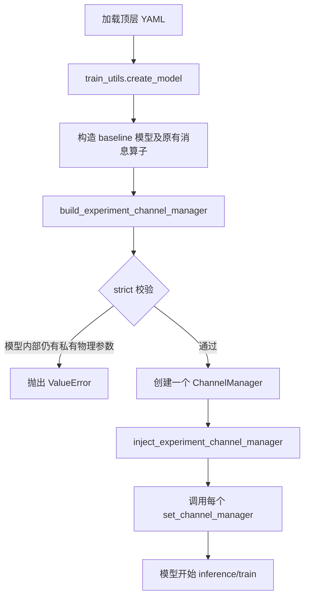

# V2V_inference 通信代码：整体结构与流程


## 1. 设计目标

通信系统分成两层：**公共物理环境** 与 **基线私有消息语义**。

- 公共环境统一定义 Markov 状态、带宽、丢包、时延和随机种子；同一次实验中只创建一个 `ChannelManager`。
- 基线只负责自身的“发什么、怎样还原”：导出特征或字节消息，调用公共环境，再还原为原先模型接口所需的张量。
- ARCE 负责消息处理策略（量化、包化、FEC、恢复及后续 UCB/C2MAB 选择）；它不再拥有独立物理信道。

这样可保证比较不同基线时，差异来自算法和消息表示，而不是各自使用不同的通信环境。

## 2. 目录与职责

```text
opencood/
├─ communication/
│  ├─ experiment_channel.py              # 实验级环境创建、严格校验、注入
│  ├─ channel/
│  │  ├─ channel_manager.py              # 唯一公共物理信道入口
│  │  ├─ fixed_channel.py                # Good/Medium/Bad profile
│  │  ├─ gilbert_elliott.py               # GE 丢包模型
│  │  └─ latency_model.py                 # 时延估计
│  └─ transport/
│     ├─ packetization/                  # 特征/字节包化
│     ├─ quantization/                   # FP16、INT8、INT4 等量化
│     ├─ fec/                            # none、XOR、raptor_sim、RaptorQ
│     └─ recovery/                       # 时间缓存、空间插值、零填充恢复
├─ methods/arce/
│  ├─ arce_fixed_comm.py                 # ARCE 执行器与传输流水线
│  └─ arce_c2mab_comm.py                 # C2MAB/UCB 调度执行器封装
├─ models/baselines/
│  ├─ rocooper/components/
│  │  ├─ rocooper_markov_comm.py         # RoCooper 薄 adapter
│  │  └─ rocooper_comm.py                # 原生特征压缩/块级恢复算子
│  ├─ cosdh/transport/                   # CoSDH 字节级薄 adapter
│  └─ coopdiff/transport/                # CoopDiff 特征级薄 adapter
└─ tools/train_utils.py                  # 模型创建后注入公共 manager
```

## 3. 公共物理环境

顶层 YAML 使用唯一入口：

```yaml
communication_environment:
  enabled: true
  strict: true
  seed: 2026
  channel:
    mode: markov
    initial_state: medium
    frame_interval_ms: 100.0
    loss_model: bernoulli
    transition_matrix: ...
    profiles:
      good:   {bandwidth_mbps: 27.0, packet_loss_rate: 0.05, delay_ms: 10.0}
      medium: {bandwidth_mbps: 5.0,  packet_loss_rate: 0.20, delay_ms: 50.0}
      bad:    {bandwidth_mbps: 1.0,  packet_loss_rate: 0.35, delay_ms: 100.0}
```

`ChannelManager` 的关键行为：

1. 以 `(link_id, frame_id)` 为粒度推进 Markov 状态；同一链路、同一帧的多尺度消息共享状态。
2. 从当前 profile 给出带宽、丢包率和时延。
3. 用 `sample_packet_loss()` 产生包级丢失掩码；Bernoulli。
4. 用 `estimate_latency()` 估计传输时延；具体消息的时间缓存/历史帧恢复仍由 adapter 或 ARCE 执行器完成。

## 4. 创建、校验与注入流程



`communication_environment.strict: true` 会扫描 `model.args`。若仍出现以下物理字段，会立即失败：

- 状态与转移：`transition_matrix`、`state_profiles`、`state_params`
- 带宽：`bandwidth_mbps`
- 丢包：`packet_loss_rate`、`packet_loss_mean`、`packet_loss_std`、`zero_fraction`
- 时延：`delay_ms`、`delay_mean_ms`、`delay_std_ms`、`max_delay_frames`

该校验只约束物理环境；量化方式、FEC 动作、消息包大小、特征选择、恢复策略等仍是基线/ARCE 的合法私有实现。

## 5. 单条消息的运行流程


adapter 的边界固定为三件事：

1. 导出待发送消息；
2. 调用共享 `ChannelManager`；
3. 将接收结果还原回原基线接口。

它不再在 YAML 或运行时创建自己的 Markov 链、带宽、丢包率或时延参数。

## 6. 各基线接入点

| 基线 | 接入位置 | 保留的私有语义 | 公共环境接管内容 |
|---|---|---|---|
| V2X-ViT | `ARCEFixedComm` | 原模型特征接口、ARCE 量化/FEC/恢复 | 状态、带宽、丢包、时延 |
| Where2Comm | `ARCEC2MABComm -> ARCEFixedComm` | Where2Comm mask、ARCE/C2MAB 动作接口 | 状态、带宽、丢包、时延 |
| CoSDH | `cosdh_markov_byte_channel.py` | 字节流、尺度/单元选择、重建 | 状态、带宽、丢包、时延 |
| CoopDiff | `coopdiff_markov_feature_channel.py` | 多尺度特征组织、扩散模型接口 | 状态、带宽、丢包、时延 |
| RoCooper | `rocooper_markov_comm.py` | 原生空间压缩和块级张量还原 | 状态、带宽预算、块丢包、时延 |

所有上述 adapter 都提供 `set_channel_manager()`。注入操作不会调用 `reset()`，以免后注入的模块清除已共享的链路状态。

## 7. RoCooper 的特殊处理

RoCooper 原本把 Markov wrapper、带宽/丢包/时延参数与自身通信模块混在一起。现在：

- `RoCooperMarkovComm` 只通过公共 manager 选择状态并取得 profile。
- `RoCooperComm` 保留原论文式的空间下采样/上采样与块级张量写回机制。
- 每帧带宽预算由 `bandwidth_mbps × frame_interval_ms` 计算；由此得到需要的空间压缩比例。
- 块丢失通过公共 `ChannelManager.sample_packet_loss()` 抽样。
- 时延值取自公共 profile；注入公共环境后，RoCooper 私有 fading 与 frame-drop 扰动被关闭。

## 8. ARCE 与 RaptorQ

`ARCEFixedComm` 是 ARCE 的传输执行器。它顺序处理：消息导出、量化、包化、FEC 编码、公共信道丢包/时延、解码和恢复，并保存链路/帧记录供评估或 UCB 使用。

RaptorQ 的真实实现位于：

```text
opencood/communication/transport/fec/fec_raptorq.py
```

当前运行环境使用 `raptorq==1.6.3`，后端为 RFC 6330 RaptorQ；它与 `raptor_sim` 是两种不同实现。真正的 RaptorQ 通过 `raptorq.Encoder/Decoder` 编码与恢复符号。

## 9. 已迁移的实验 YAML

- `opencood/hypes_yaml/point_pillar_v2xvit_opv2v_arce_markov.yaml`
- `opencood/hypes_yaml/point_pillar_rocooper_opv2v_markov_sync_add_coopdiff.yaml`
- `opencood/hypes_yaml/v2xreal/point_pillar_v2xvit_native_payload_arce_markov_v2xreal_vc.yaml`
- `opencood/hypes_yaml/v2xreal/point_pillar_cosdh_markov_v2xreal_vc.yaml`
- `opencood/hypes_yaml/v2xreal/point_pillar_v2xvit_markov_v2xreal_vc.yaml`
- `opencood/hypes_yaml/v2xreal/point_pillar_diff_student_markov_v2xreal_vc.yaml`
- `opencood/hypes_yaml/v2xreal/point_pillar_rocooper_markov_v2xreal_vc.yaml`
- `opencood/hypes_yaml/opv2v/lidar_only/pointpillar_cosdh_markov.yaml`
- `opencood/hypes_yaml/v2xreal/point_pillar_where2comm_arce_c2mab_v2xreal_vc.yaml`

可运行以下脚本复核迁移与注入：

```bash
PYTHONPATH=. python scripts/migrate_communication_environment_yaml.py --verify
PYTHONPATH=. python scripts/test_experiment_channel_injection.py
```

## 10. 当前已知事项

- Where2Comm 的 C2MAB YAML 仍含历史遗留的过期 reward 字段（`alpha_q` 等）；当前 C2MAB schema 要求 `lambda_ap`、`lambda_cost`、`lambda_delay`、`lambda_quant`、`lambda_violate` 等。该问题属于 UCB/C2MAB 配置兼容性，未在本次通信环境迁移中修改。
- `wild_setting.transmission_speed` 与 `backbone_delay` 是数据集异步模拟字段，不是 baseline adapter 的私有 Markov 物理环境；当前统一通信比较使用 `communication_environment`。
- 旧的 fixed-sweep / ablation YAML 未列在本说明的 Markov 主实验范围内。若要纳入同一对比，应为其显式增加顶层 `communication_environment`，而不是把当前 Markov profile 直接覆盖到固定状态消融实验。
